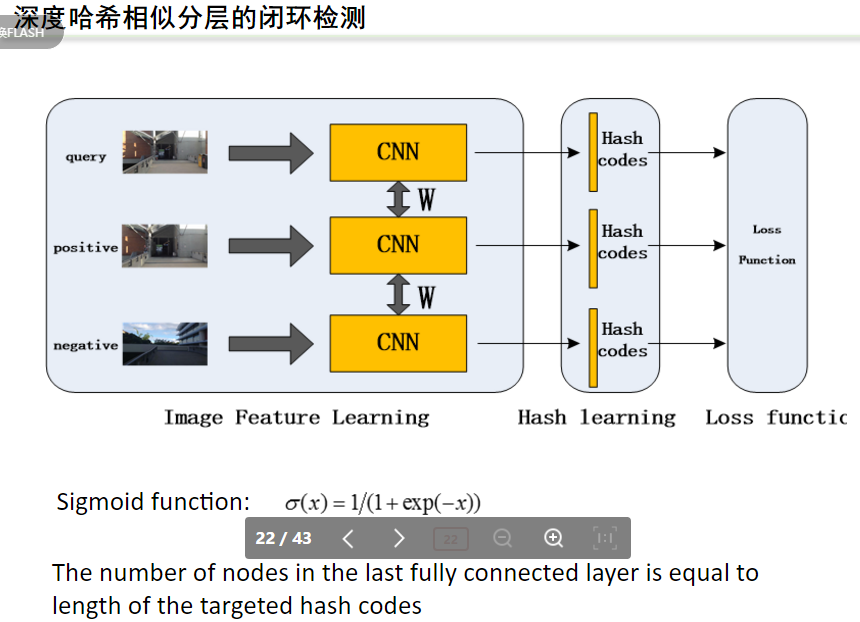

# VSLAM现状与发展讨论

吴毅红老师

视觉SLAM主要分为两块，几何SLAM和学习SLAM

主要介绍学习SLAM

* 几何与学习融合，以传统几何SLAM为主框架

  * 
  * 

* 端到端的SLAM（监督

  * 
  * 

* 端到端的SLAM（非监督

  * 
  * 
  * 

* 非监督循环神经网络

  * 
  * 

  非监督缺乏几何信息的约束，精度无法取得最优

  深度学习的方法可以在一定程度上克服传统集合方法的不鲁棒性问题，但缺乏泛化能力

“计算机视觉的根本问题是一个鲁棒性问题，如果不考虑鲁棒性问题的话，计算机视觉几乎所有问题都解决了” ---前IEEE Trans. PAMI主编

吴毅红老师的近期工作

1、FMD-SLAM 

2、动态目标SLAM中的运动模糊抠图

3、大场景中深度哈希学习描述子与随机森林结合的SLAM重定位

未来展望：

继续发展马尔视觉理论

只是在loss function上的融合是不够的，后续希望能看到对于底层如CNN这些的融合

邹丹平老师

Visual+Inertial SLAM   man-made environment

PANEL议题

* SLAM的未来发展之路在哪里？ 还有哪些问题有待解决？
* 深度学习对SLAM的影响？
* SLAM的产学研如何做？
* 无人机、自动驾驶上哪种SLAM方案更有前景？视觉还是激光？